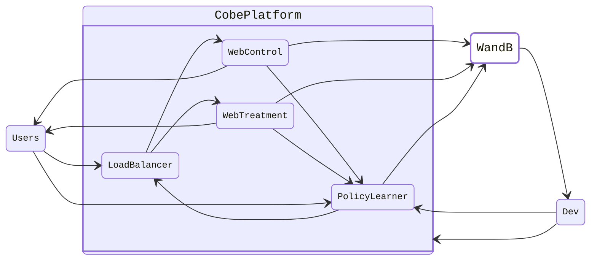

<!-- Improved compatibility of back to top link: See: https://github.com/othneildrew/Best-README-Template/pull/73 -->
<a name="readme-top"></a>
<!--
*** Thanks for checking out the Best-README-Template. If you have a suggestion
*** that would make this better, please fork the repo and create a pull request
*** or simply open an issue with the tag "enhancement".
*** Don't forget to give the project a star!
*** Thanks again! Now go create something AMAZING! :D
-->


<!-- PROJECT SHIELDS -->
<!--
*** I'm using markdown "reference style" links for readability.
*** Reference links are enclosed in brackets [ ] instead of parentheses ( ).
*** See the bottom of this document for the declaration of the reference variables
*** for contributors-url, forks-url, etc. This is an optional, concise syntax you may use.
*** https://www.markdownguide.org/basic-syntax/#reference-style-links
-->
[![Contributors][contributors-shield]][contributors-url]
[![Forks][forks-shield]][forks-url]
[![Stargazers][stars-shield]][stars-url]
[![Issues][issues-shield]][issues-url]
[![MIT License][license-shield]][license-url]
[![LinkedIn][linkedin-shield]][linkedin-url]


<!-- PROJECT LOGO -->
<br />
<div align="center">
  <a href="https://github.com/wirrywoo/cobe-platform">
    
  </a>

<h3 align="center">The Containerized Online Bandit Experimentation (COBE) Platform</h3>

  <p align="center">
    A containerized experimentation platform built to monitor online controlled experiments learned under contextual bandit policies in real-time. Received <b>Honorable Mention</b> in <a href="https://docker.devpost.com/">2023 Docker AI/ML Hackathon</a>. 
<!--     <br />
    <a href="https://github.com/wirrywoo/cobe-platform/"><strong>Explore the docs »</strong></a>
    <br /> -->
    <br />
    <br />
    <a href="https://www.youtube.com/watch?v=iHAt1286_4c">View Demo</a>
    ·
    <a href="https://devpost.com/software/containerized-online-bandit-experimentation-cobe-platform">View Devpost Submission</a>
    ·
    <a href="https://github.com/wirrywoo/cobe-platform/issues">Report Bug</a>
    ·
    <a href="https://github.com/wirrywoo/cobe-platform/issues">Request Feature</a>
  </p>
</div>


<!-- TABLE OF CONTENTS -->
<details>
  <summary>Table of Contents</summary>
  <ol>
    <li>
      <a href="#about-the-project">About The Project</a>
      <ul>
        <li><a href="#built-with">Built With</a></li>
      </ul>
    </li>
    <li>
      <a href="#getting-started">Getting Started</a>
      <ul>
        <li><a href="#prerequisites">Prerequisites</a></li>
        <li><a href="#installation">Installation</a></li>
      </ul>
    </li>
    <li><a href="#usage">Usage</a></li>
    <li><a href="#roadmap">Roadmap</a></li>
    <li><a href="#contributing">Contributing</a></li>
    <li><a href="#license">License</a></li>
    <li><a href="#contact">Contact</a></li>
    <li><a href="#acknowledgments">Acknowledgments</a></li>
  </ol>
</details>


<!-- ABOUT THE PROJECT -->
## About The Project

The Containerized Online Bandit Experimentation (COBE) Platform is built to monitor the performance of online controlled experiments learned under contextual bandit policies in real-time. The COBE Platform seeks to address the issues that standard A/B Testing is unable to resolve, including the following:

- What if the chosen variation during the rollout phase of the experimentation process degrades in performance over time?
- Will personalizing the choice of variation for each user successfully optimize the targeted metric?
- Is there a faster way to identify better performing variations at a lower opportunity cost? 
 
Many companies with an experimentation-first culture can highly benefit from utilizing online controlled experiments to improve their experimentation strategies by adjusting and optimizing future decisions based on the data collected from each observation. For example, [Stitch Fix](https://multithreaded.stitchfix.com/blog/2020/08/05/bandits/) uses multi-armed bandits in their experimentation platform to support the implementation of various bandit policies, allowing data scientists to implement their own reward models and plug them into the allocation engine via a dedicated microservice for each bandit experiment. 

Inspired by Stitch Fix's case study, we built the COBE Platform using $n$ Docker containers to isolate all variations of the landing page to respect the definition of the experiment, where only the tested variation is changed across different containers. Additionally, a HTTP load balancer container is created to split the population of all users into one of $n$ treatments. Lastly, a policy learner container is built to learn a policy that aims to optimize the targeted metric using an online contextual bandit system. Shown below is a high-level diagram that visualizes the technical architecture of the COBE Platform in its current state for $n = 2$ (one control and one treatment).


### Built With

* [![Python][python-shield]][python-url]
* [![Docker][docker-shield]][docker-url]
* [![Django][django-shield]][django-url]
* [![JQuery][jquery-shield]][jquery-url]
* [![Gunicorn][gunicorn-shield]][gunicorn-url]
* [![NGINX][nginx-shield]][nginx-url]
* [![VowpalWabbit][vw-shield]][vw-url]
* [![Weights and Biases][wandb-shield]][wandb-url]
* [![Ubuntu][ubuntu-shield]][ubuntu-url]
* [![Visual Studio Code][vscode-shield]][vscode-url]

<p align="right">(<a href="#readme-top">back to top</a>)</p>


<!-- GETTING STARTED -->
## Getting Started

### Prerequisites

1. Create and sign into your [Weights and Biases](https://wandb.ai/) account.
2. Locate the API Key [here](https://wandb.ai/authorize), copy it and add the secret key in the `.env` file under environment variable `WANDB_API_KEY`.
3. Install [Docker Desktop](https://www.docker.com/products/docker-desktop/).

### Installation

1. Clone the repository to your local environment.
   
   ```sh
   git clone https://github.com/wirrywoo/cobe-platform.git
   ```
2. Go into the `cobe-platform` main directory and build the containers.

   ```sh
   cd cobe-platform; docker compose up -d
   ```
3. Go to browser and enter `http://127.0.0.1/cobe-platform-demo/?seed=1` to see control group and `http://127.0.0.1/cobe-platform-demo/?seed=3` to see treatment group.
<p align="right">(<a href="#readme-top">back to top</a>)</p>


[](https://colab.research.google.com/drive/1ESKuxGevumiloMkdsoOAZQ3vgfsFojaF?usp=sharing)


## Control vs. Treatment


## Visualizations
**Average Reward Performance of Control vs. Treatment Variations**


**Updating NGINX Probabilities from CB Learning**


<p align="right">(<a href="#readme-top">back to top</a>)</p>


<!-- USAGE EXAMPLES 
## Usage

Use this space to show useful examples of how a project can be used. Additional screenshots, code examples and demos work well in this space. You may also link to more resources.

_For more examples, please refer to the [Documentation](https://example.com)_

<p align="right">(<a href="#readme-top">back to top</a>)</p>-->


<!-- ROADMAP 
## Future State

- [ ] Feature 1
- [ ] Feature 2
- [ ] Feature 3
    - [ ] Nested Feature

See the [open issues](https://github.com/wirrywoo/cobe-platform/issues) for a full list of proposed features (and known issues).

<p align="right">(<a href="#readme-top">back to top</a>)</p>-->


<!-- CONTRIBUTING 
## Contributing

Contributions are what make the open source community such an amazing place to learn, inspire, and create. Any contributions you make are **greatly appreciated**.

If you have a suggestion that would make this better, please fork the repo and create a pull request. You can also simply open an issue with the tag "enhancement".
Don't forget to give the project a star! Thanks again!

1. Fork the Project
2. Create your Feature Branch (`git checkout -b feature/AmazingFeature`)
3. Commit your Changes (`git commit -m 'Add some AmazingFeature'`)
4. Push to the Branch (`git push origin feature/AmazingFeature`)
5. Open a Pull Request

<p align="right">(<a href="#readme-top">back to top</a>)</p>
-->


<!-- LICENSE -->
## License

Distributed under the MIT License. See `LICENSE.txt` for more information.

<p align="right">(<a href="#readme-top">back to top</a>)</p>


<!-- CONTACT -->
## Contact

Wilson Cheung - [Personal Website](https://wilsoncheung.me/) - info@wilsoncheung.me

Project Link: [https://github.com/wirrywoo/cobe-platform](https://github.com/wirrywoo/cobe-platform)

<p align="right">(<a href="#readme-top">back to top</a>)</p>


<!-- ACKNOWLEDGMENTS
## Acknowledgments

* []()
* []()
* []()

<p align="right">(<a href="#readme-top">back to top</a>)</p> -->


<!-- MARKDOWN LINKS & IMAGES -->
<!-- https://www.markdownguide.org/basic-syntax/#reference-style-links -->
[contributors-shield]: https://img.shields.io/github/contributors/wirrywoo/cobe-platform.svg
[contributors-url]: https://github.com/wirrywoo/cobe-platform/graphs/contributors
[forks-shield]: https://img.shields.io/github/forks/wirrywoo/cobe-platform.svg
[forks-url]: https://github.com/wirrywoo/cobe-platform/network/members
[stars-shield]: https://img.shields.io/github/stars/wirrywoo/cobe-platform.svg
[stars-url]: https://github.com/wirrywoo/cobe-platform/stargazers
[issues-shield]: https://img.shields.io/github/issues/wirrywoo/cobe-platform.svg
[issues-url]: https://github.com/wirrywoo/cobe-platform/issues
[license-shield]: https://img.shields.io/github/license/wirrywoo/cobe-platform
[license-url]: https://github.com/wirrywoo/cobe-platform/blob/main/LICENSE.txt
[linkedin-shield]: https://img.shields.io/badge/-LinkedIn-black.svg?logo=linkedin&colorB=555
[linkedin-url]: https://linkedin.com/in/wcheung-in/
[product-screenshot]: images/screenshot.png

[python-shield]: https://img.shields.io/badge/Python-3776AB.svg?style=for-the-badge&logo=Python&logoColor=white
[python-url]: https://www.python.org/
[jquery-shield]: https://img.shields.io/badge/jQuery-0769AD.svg?style=for-the-badge&logo=jQuery&logoColor=white
[Jquery-url]: https://jquery.com 
[django-shield]: https://img.shields.io/badge/Django-092E20.svg?style=for-the-badge&logo=Django&logoColor=white
[django-url]: https://www.djangoproject.com/
[gunicorn-shield]: https://img.shields.io/badge/Gunicorn-499848.svg?style=for-the-badge&logo=Gunicorn&logoColor=white
[gunicorn-url]: https://gunicorn.org/
[nginx-shield]: https://img.shields.io/badge/NGINX-009639.svg?style=for-the-badge&logo=NGINX&logoColor=white
[nginx-url]: https://www.nginx.com/
[vw-shield]: https://img.shields.io/badge/Vowpal%20Wabbit-FF81F9.svg?style=for-the-badge&logo=Vowpal-Wabbit&logoColor=black
[vw-url]: https://vowpalwabbit.org/
[wandb-shield]: https://img.shields.io/badge/Weights%20&%20Biases-FFBE00.svg?style=for-the-badge&logo=weightsandbiases&logoColor=black
[wandb-url]: https://wandb.ai/
[docker-shield]: https://img.shields.io/badge/Docker-2496ED.svg?style=for-the-badge&logo=Docker&logoColor=white
[docker-url]: https://www.docker.com/
[ubuntu-shield]: https://img.shields.io/badge/Ubuntu-E95420.svg?style=for-the-badge&logo=Ubuntu&logoColor=white
[ubuntu-url]: https://ubuntu.com/
[vscode-shield]: https://img.shields.io/badge/Visual%20Studio%20Code-007ACC.svg?style=for-the-badge&logo=Visual-Studio-Code&logoColor=white
[vscode-url]: https://code.visualstudio.com/

